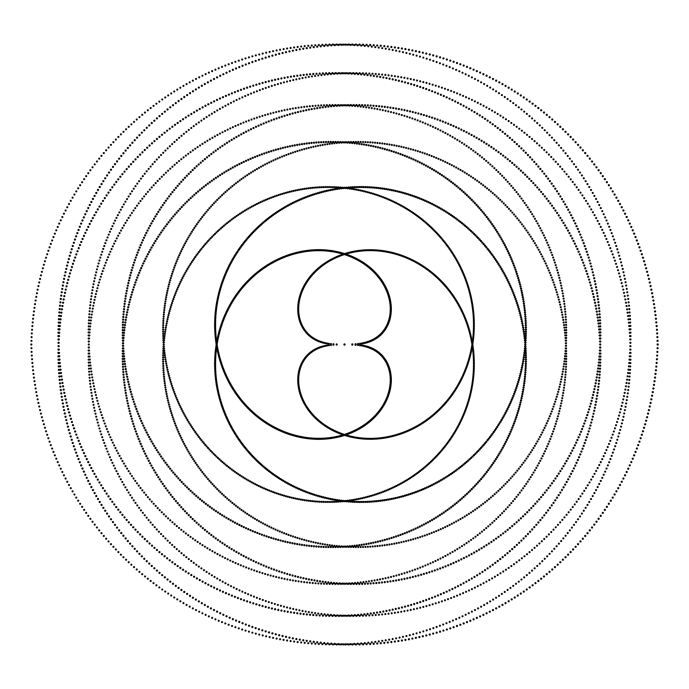
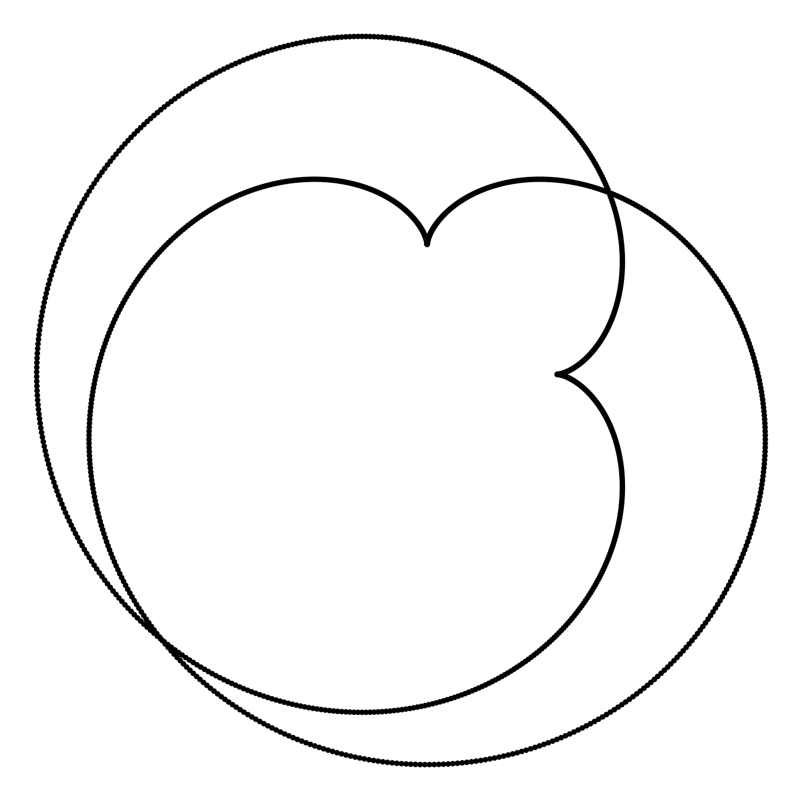

```{r,echo=FALSE,eval=TRUE,results='hide',warning=FALSE,message=FALSE}

if(!require(ggplot2)){install.packages("ggplot2")}
library(ggplot2)
if(!require(tidyverse)){install.packages("tidyverse")}
library(tidyverse)

```

# Resumo

*  Introdução
* Visualização de dados
* Matemática
* Algoritmo e construções
* Transformações
* Modelo RGB
* Alguns Resultados
* Considerações Finais e  Referências 

<!--
* Introdução
    * R 
    * VI Seminário Internacional de Estatística com R-2022
    * Construções iniciais e transformações
* Código geral e Cores
* Resultados
    * Cores I   - alguns exemplos
    * Cores II  - escolha sequencial
    * Cores III - escolha aleatória
    * Cores IV  -  mapas gradientes
    * Explorações
* Considerações finais
-->

# Introdução: R/RPosit

\begin{itemize}
\item Linguagem de programação e ambiente estatístico.
\item Utilizada na análise e visualização de dados. 
\item Desenvolvida por estatísticos. 
\item Código aberto com uma vasta coleção de pacotes que permitem manipular, visualizar e modelar dados de forma eficiente.

```{r, echo=FALSE, out.width = '70%',fig.align='center'}
# Instalar e carregar o pacote ggplot2 (se ainda não estiver instalado)

# Data. Model: Y = X ^ 2
set.seed(54)
x <- seq(0, 10, by = 0.05)
y <- x ^ 2 + rnorm(length(x), sd = 20)

# Linear model
modelo <- lm(y ~ x)

# Scatter plot and linear regression line
plot(x, y, pch = 16,xlab="Eixo X",ylab="Eixo Y")

# Segments with error terms
segments(x0 = x, x1 = x, y0 = y, y1 = predict(modelo),
         lwd = 1, col = "red") 

# Regression line
abline(modelo, col = 4, lwd = 3)

# Paint the points again over the segments
points(x, y, pch = 16)

# Text
coef <- round(coef(modelo), 2)
text(2, 70,  paste("Y = ", coef[1], "+", coef[2], "x"),pch=16) 
```


\end{itemize}


# Visualização

```{r,echo=FALSE,fig.align='center',out.width="70%"}
moxbuller = function(n) {   
    u = runif(n)  
    v = runif(n)   
    x = cos(2*pi*u)*sqrt(-2*log(v))  
    y = sin(2*pi*v)*sqrt(-2*log(u))
    r = list(x=x, y=y)
    return(r) 
}
r = moxbuller(50000) 
par(bg="black") 
par(mar=c(0,0,0,0)) 
plot(r$x,r$y, pch=".", col="blue", cex=1.2)
```

# $f(x,y)=\dfrac{\sin\left(\sqrt{x^2+y^2}\right)}{\sqrt{x^2+y^2}}$

```{r,echo=FALSE,fig.align='center',out.width="90%"}
# Generate data for the plot
x <- seq(-25, 25, length.out = 100)
y <- seq(-25, 25, length.out = 100)
z <- outer(x, y, function(x, y) sin(sqrt(x^2 + y^2))/sqrt(x^2 + y^2))

# Create the plot
persp(x, y, z, theta = 30, phi = 30, expand = 0.5, col = "green")

#require("grDevices") # for colours
#filled.contour(volcano, asp = 1) # simple

```


# Curvas paramétricas: $x=f(t)$ e $y=g(t)$, $t\in [a,b]$

\begin{minipage}{\textwidth}

\begin{minipage}{.32\textwidth}

```{r, echo=FALSE, out.width = '90%'}

knitr::include_graphics("Circulo01.png")

```
\end{minipage}
\begin{minipage}{.32\textwidth}
```{r, echo=FALSE, out.width = '90%'}

knitr::include_graphics("Elipse01.png")

```
\end{minipage}
\begin{minipage}{.32\textwidth}
```{r, echo=FALSE, out.width = '90%'}

knitr::include_graphics("Astroide01.png")

```
\end{minipage}

\begin{minipage}{.32\textwidth}
```{r, echo=FALSE, out.width = '90%'}

knitr::include_graphics("Cardioide01.png")

```
\end{minipage}
\begin{minipage}{.32\textwidth}
```{r, echo=FALSE, out.width = '90%'}


```
\end{minipage}
\begin{minipage}{.32\textwidth}
```{r, echo=FALSE, out.width = '90%'}

knitr::include_graphics("LemniscataBernouli01.png")

```
\end{minipage}
\end{minipage}


# Composições com movimentos rígidos

\begin{minipage}{\textwidth}
\begin{minipage}{.32\textwidth}

```{r, echo=FALSE, out.width = '90%'}


```
\end{minipage}
\begin{minipage}{.32\textwidth}

```{r, echo=FALSE, out.width = '90%'}


```
\end{minipage}
\begin{minipage}{.32\textwidth}
```{r, echo=FALSE, out.width = '90%'}



```
\end{minipage}

\begin{minipage}{.32\textwidth}

```{r, echo=FALSE, out.width = '90%'}


```

\end{minipage}
\begin{minipage}{.32\textwidth}

```{r, echo=FALSE, out.width = '90%'}

knitr::include_graphics("MandalaAstroide02_01.png")

```
\end{minipage}
\begin{minipage}{.32\textwidth}

```{r, echo=FALSE, out.width = '90%'}

knitr::include_graphics("MandalaEscudo02.png")

```
\end{minipage}
\end{minipage}


# Modelo de cores \textit{Red Green Blue} (RGB)

\begin{minipage}{\textwidth}
\begin{minipage}{.32\textwidth}
```{r, echo=FALSE, out.width = '90%'}

knitr::include_graphics("MandalaInfinito01Colorida03.png")

```
\end{minipage}
\begin{minipage}{.32\textwidth}
```{r, echo=FALSE, out.width = '90%'}

knitr::include_graphics("MandalaInfinito01Colorida04.png")

```
\end{minipage}
\begin{minipage}{.32\textwidth}
```{r, echo=FALSE, out.width = '90%'}

knitr::include_graphics("MandalaInfinito01Colorida03_13.png")

```
\end{minipage}


\begin{minipage}{.32\textwidth}
```{r, echo=FALSE, out.width = '90%'}


```
\end{minipage}
\begin{minipage}{.32\textwidth}

```{r, echo=FALSE, out.width = '90%'}

knitr::include_graphics("MandalaInfinito01Colorida03_15.png")

```

\end{minipage}
\begin{minipage}{.32\textwidth}

```{r, echo=FALSE, out.width = '90%'}

knitr::include_graphics("MandalaInfinito01Colorida03_20.png")

```
\end{minipage}
\end{minipage}


# E-book

```{r, echo=FALSE, out.width = '90%'}


```


# Algoritmo

* Escolher as curvas ou figuras geométricas.

    * curvas clássicas: lemniscata de Bernouli, lemniscata de Gerono, deltoide, astroide, entre outras. 

    * figuras geométricas: triângulos, retângulos, polígonos regulares, etc. 

* Aplicar transformações geométricas

    * rotação.

    * translação.

    * homotetia.

* Realizar a escolha do modelo de cores e escolha da paleta de cores. 

    * R possui $657$ cores disponíveis+pacotes.

* Especificar o padrão de cores:

    * quais cores em cada objeto ou objetos.

* Composição de uma ou mais figuras.


# Construções iniciais

\begin{minipage}{\textwidth}
\begin{minipage}{.32\textwidth}
```{r, echo=FALSE, out.width = '90%'}

knitr::include_graphics("Cardioide01.png")

```
\end{minipage}
\begin{minipage}{.32\textwidth}
\end{minipage}
\begin{minipage}{.32\textwidth}

```{r, echo=FALSE, out.width = '90%'}



```
\end{minipage}
\begin{minipage}{.32\textwidth}

```{r, echo=FALSE, out.width = '90%'}


```
\end{minipage}


\begin{minipage}{.32\textwidth}
```{r, echo=FALSE, out.width = '90%'}


```
\end{minipage}
\begin{minipage}{.32\textwidth}
```{r, echo=FALSE, out.width = '90%'}


```
\end{minipage}
\begin{minipage}{.32\textwidth}
```{r, echo=FALSE, out.width = '90%'}


```
\end{minipage}
\end{minipage}


# Transformações rígidas

\begin{minipage}{\textwidth}
\begin{minipage}{.475\textwidth}
```{r, echo=FALSE, out.width = '90%'}


```

\end{minipage}
\begin{minipage}{.475\textwidth}
```{r, echo=FALSE, out.width = '90%'}


```

\end{minipage}
\end{minipage}


# Códigos
\tiny 
```{r eval=T, include=T}
require(ggplot2)
n=1000; theta=seq(0,2*pi, length.out = n)
x=2*cos(theta)+cos(2*theta)
y=2*sin(theta)-sin(2*theta)
z=rep(0,n); dt=tibble::tibble(x,y,z)
step=pi#0.125
rotacao=c(seq(0,pi,step)); xt=x; yt=y
p=ggplot()+coord_fixed()+theme_void()
for(i in 1:length(rotacao)){
  xt=c(xt,x[1:n]*cos(rotacao[i])-y[1:n]*sin(rotacao[i]))
  yt=c(yt,x[1:n]*sin(rotacao[i])+y[1:n]*cos(rotacao[i]))
  }
```

```{r eval=T, include=T}
red=c(seq(0.2,1,0.2))
cores=c("black","blue","cyan","green","red")
for(i in 1:length(red)){
  xtt=c(xt*red[i])
  ytt=c(yt*red[i])
  dt=data.frame(x=c(xt, xtt), y=c(yt, ytt), z="astroide")      
  p=p+geom_point(data=dt, aes(x=x, y=y),size=0.05,
  color=cores[i])
        }   

```

```{r, echo=FALSE, out.width='20%',fig.align='center'}

p

```

\normalsize


# Cores em R: Modelo RGB
\tiny

\begin{verbatim}
[1,]  "white"   "aquamarine3"   "bisque2"   "blueviolet"    "aliceblue"   "aquamarine4"   "bisque3"     
\end{verbatim}

```{r,out.width='60%',fig.align='center'}
p=p +theme(panel.background = element_rect(fill = "black")  )
p

```


# Astroide, Deltoide, Lemniscata de Bernouli

\begin{minipage}{\textwidth}
\begin{minipage}{.32\textwidth}
red=c(seq(0.2,1,0.01))
```{r, echo=FALSE, out.width = '90%'}


```
\end{minipage}
\begin{minipage}{.32\textwidth}
red=c(seq(0.2,1,0.0175))

```{r, echo=FALSE, out.width = '90%'}


```
\end{minipage}
\begin{minipage}{.32\textwidth}
```{r, echo=FALSE, out.width = '90%'}


```
\end{minipage}


\begin{minipage}{.32\textwidth}
```{r, echo=FALSE, out.width = '90%'}


```
\end{minipage}
\begin{minipage}{.32\textwidth}
```{r, echo=FALSE, out.width = '90%'}

knitr::include_graphics("MandalaInfinito01Colorida04.png")

```

\end{minipage}
\begin{minipage}{.32\textwidth}

```{r, echo=FALSE, out.width = '90%'}


```

\end{minipage}
\end{minipage}

#  Escolha sequencial I

\begin{minipage}{\textwidth}
\begin{minipage}{.475\textwidth}
step=0.0075;red=seq(.1,1,by=step);
```{r, echo=FALSE, out.width = '105%'}

knitr::include_graphics("MandalaInfinito01Colorida03_5.png")

```

\end{minipage}
\begin{minipage}{.475\textwidth}
step=0.005;red=seq(.1,1.,by=step);
```{r, echo=FALSE, out.width = '105%'}

knitr::include_graphics("MandalaInfinito01Colorida03_12.png")

```

\end{minipage}
\end{minipage}


# Escolha sequencial II

\begin{minipage}{\textwidth}

\begin{minipage}{.475\textwidth}

"white"-"darkgreen"

```{r, echo=FALSE, out.width = '105%'}

knitr::include_graphics("MandalaInfinito01Colorida03_13.png")

```

\end{minipage}
\begin{minipage}{.475\textwidth}

"white"-"grey82"

```{r, echo=FALSE, out.width = '105%'}


```

\end{minipage}
\end{minipage}


# Aleatorização do processo de escolha

* cores=sample(colors()[1:27],length(contracao),replace=T)

* MinhasCores=rep(cores,floor(length(contracao)/length(cores))+1)

\begin{minipage}{\textwidth}

\begin{minipage}{.475\textwidth}

colors()[1:27]

```{r, echo=FALSE, out.width = '105%'}

knitr::include_graphics("MandalaInfinito01Colorida03_19Random.png")

```

\end{minipage}
\begin{minipage}{.475\textwidth}

colors()[300:361]

```{r, echo=FALSE, out.width = '105%'}


```

\end{minipage}

\end{minipage}


# Mapas gradientes

* MyColor=rainbow((nrot+2)*length(x), s = 1, v = 1, start = 0, end = max(1, n - 1)/n, alpha = 1)

* require(colorspace); MyColor=heat.colors((nrot+2)*length(x))

\begin{minipage}{\textwidth}

\begin{minipage}{.475\textwidth}

```{r, echo=FALSE, out.width = '105%'}


```

\end{minipage}
\begin{minipage}{.475\textwidth}

```{r, echo=FALSE, out.width = '105%'}

knitr::include_graphics("MandalaInfinito01Colorida03_20.png")

```

\end{minipage}
\end{minipage}


# Explorações I

* Homotetias direção crescente.
* Homotetias direção decrescente.

\begin{minipage}{\textwidth}
\begin{minipage}{.475\textwidth}
```{r, echo=FALSE, out.width = '105%'}
knitr::include_graphics("MandalaInfinito01Colorida03_29.png")
```
\end{minipage}
\begin{minipage}{.475\textwidth}
```{r, echo=FALSE, out.width = '105%'}
knitr::include_graphics("MandalaInfinito01Colorida03_29_1.png")
```
\end{minipage}
\end{minipage}


# Explorações II

\begin{minipage}{\textwidth}
\begin{minipage}{.475\textwidth}
```{r, echo=FALSE, out.width = '105%'}
knitr::include_graphics("MandalaCardioideColoridoPsico01.png")
```
\end{minipage}
\begin{minipage}{.475\textwidth}
```{r, echo=FALSE, out.width = '105%'}
knitr::include_graphics("MandalaEspiral01_02.png")
```
\end{minipage}

\end{minipage}


# Considerações Finais

* Interesse em expandir o potencial de utilização do R
    * Explorações iniciais com as curvas planas
    * Construções das curvas planas e desenvolvimento das ideias dos movimentos rígidos
    * Processo de construção e desenvolvimento do algoritmo
    * Cores: sem um padrão aparente $\Rightarrow$ sem conhecimento prévio
  
* Resultados restritos às curvas planas não excluem outras possibilidades.

* Potencial educacional
    
    * Problemas matemáticos associados
        * combinatória: $\approx 657*656^{n-1}$ possibilidades de construção sem repetição de cores pareadas. 
        * estatística: histograma de cores, etc. 
        * progressões: cardioide
        * geometria plana, cálculo, etc. 

    * Programação: elementos básicos e avançados. 


# Referências 

\tiny

* Coxeter, H. S.M., and S. L. Greitzer. 1967. Geometry Revisited. The Mathematical Association of America.

* Ferréol, R., S. Boureau, and A Esculier. 2017. "2D Curves." \href{https:\/\/mathcurve.com\/courbes2d.gb\/lemniscate\/lemniscate.shtml\#:\~:text=\%2D\%20the\%20lemniscate\%20of\%20Bernoulli\%20is,they\%20correspond\%20to\%20minima…}{Disponível aqui!!!}

* Nascimento Venceslau, Allisson Wesley do. 2015. "Curvas Parametrizadas, Ciclóides, Experimentos E Aplicações." Universidade Federal de Sergipe.

<!--

* Bezerra, J. 2022. "Mandalas." Toda Materia. https://www.todamateria.com.br/mandala/.

* Medeiros, D.S. 2022. "Aula Interativa: Ciclóides." https://aulainterativa.ect.ufrn.br/cicloides/.

* O'Connor, John, and Edmund Robertson. 2001. "A History of Pi." MacTutor. https://mathshistory.st-andrews.ac.uk/HistTopics/Pi_through_the_ages/.

* ———. 2022d. "Curves: Hypocycloid." MacTutor. https://mathshistory.st-andrews.ac.uk/Curves/Hypocycloid/.

* ———. 2022f. "Curves: Fermats." MacTutor. https://mathshistory.st-andrews.ac.uk/Curves/Fermats/.

* ———. 2022g. "Curves: Lemacon of Pascal." MacTutor. https://mathshistory.st-andrews.ac.uk/Curves/Limacon/.

-->

* ———. 2022a. "Curves: Circle." MacTutor. \href{https:\/\/mathshistory.st-andrews.ac.uk\/Curves\/Circle\/}{Disponível aqui!!!}.

* ———. 2022b. "Curves: Elipse." MacTutor. \href{https:\/\/mathshistory.st-andrews.ac.uk\/Curves/Ellipse\/}{Disponível aqui!!!}.

* ———. 2022c. "Curves: Cardioid." MacTutor. \href{https:\/\/mathshistory.st-andrews.ac.uk\/Curves\/Cardioid\/}{Disponível aqui!!!}.

* ———. 2022e. "Curves: Astroid." MacTutor. \href{https:\/\/mathshistory.st-andrews.ac.uk\/Curves\/Astroid\/}{Disponível aqui!!!}.

* Hadley Wickham, ggplot2: Elegant Graphics for Data Analysis, Springer-Verlag New York, 2016.

* Kirill Müller and Hadley Wickham, tibble: Simple Data Frames, 2020, R package version 3.0.4. \href{https:\/\/CRAN.R-project.org\/package=tibble}{Disponível aqui!!!}.

* Yihui Xie (2021). knitr: A General-Purpose Package for

  Dynamic Report Generation in R. R package version 1.33.

* Yihui Xie (2015) Dynamic Documents with R and knitr. 2nd

  edition. Chapman and Hall/CRC. ISBN 978-1498716963

* Yihui Xie (2014) knitr: A Comprehensive Tool for

  Reproducible Research in R. In Victoria Stodden, Friedrich

  Leisch and Roger D. Peng, editors, Implementing Reproducible

  Computational Research. Chapman and Hall/CRC. ISBN

  978-1466561595

  

* Sunil, M., and R. Kosawatta. 2017. CliffsNotes Geometry Common Core Quick Review. HMH Books.

* Weisstein, Eric W. 20022a. "Ellipse." From MathWorld–A Wolfram Web Resource. \href{https:\/\/mathworld.wolfram.com\/Ellipse.html}{Disponível aqui!!!}.

* ———. 20022b. "Cardioid." From MathWorld–A Wolfram Web Resource. \href{https:\/\/mathworld.wolfram.com\/Cardioid.html}{Disponível aqui!!!}.

* ———. 20022c. "Deltoid." From MathWorld–A Wolfram Web Resource. \href{https:\/\/mathworld.wolfram.com\/Deltoid.html}{Disponível aqui!!!}.

* ———. 20022d. "Astroid." From MathWorld–A Wolfram Web Resource. \href{https:\/\/mathworld.wolfram.com\/Astroid.html}{Disponível aqui!!!}.

# Obrigado!

* contato: P06, 6815


